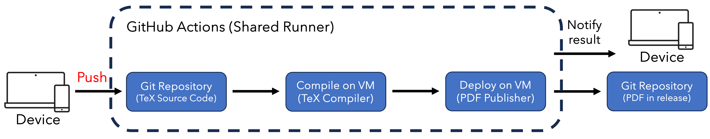

<!-- PROJECT SHIELDS -->
[![Contributors][contributors-shield]][contributors-url]
[![Forks][forks-shield]][forks-url]
[![Stargazers][stars-shield]][stars-url]
[![Issues][issues-shield]][issues-url]
[![MIT License][license-shield]][license-url]

![Social preview][socialpreview-url]

<!-- ABOUT -->
# Leopard CI/CD Client

Leopard is – the most widespread habitat in the cat family's component species – a thin client of a LaTeX compilation CI/CD, hence the name lepard (binomen Panthera pardus) as it belongs to the panthera family.

Leopards are excellent environmental adapters, resting in trees and on rocks when not hunting. Although they are on the smaller side of the big cats, they are high-performance hunters, even in forests, with their supple bodies and clever intelligence. 
Overall, this CI/CD is a sophisticated and compact client of the LaTeX compilation environment. 
Features include: procurement of computational resources only when compiling LaTeX, no need to build the user's own environment, and rapid PDF distribution; the ability to customise the user's own package by changing the '[xu-cheng/latex-action@v3](https://github.com/marketplace/actions/github-action-for-latex)' use options, and the ability to apply to a variety of modern user environments.

<!-- INSTALL -->
## Quick started
All you have to do is fork this repository, extract the tex files to the root directory and push. Import with the repository name of your choice. 
How to build using a sample tex file with ```make```.
```
make sample
```
After executing git add, commit and push, about
2 minutes this workflow is finished and your LaTeX compiled PDF is provided to the release. 
See below for instructions on how to clean out the tex files extracted to the root directory.
```
make sample-clean
```

For constrained runtime environments where make is not available, read and run the scripts described in the Makefile. 
See all [Makefile](./Makefile).

### requirement
Workflow permissions need to be given read/write permissions as read permissions alone are not sufficient.

### Installation

### Fetch non-default TeX file templates

This is LaTeX templates for which the compilation results have been verified.
<details>
<summary>Supported LaTeX Templates</summary>

.. 

</details>

This is LaTeX template that has not yet been tested by someone else.
<details>
<summary>The following distribution versions are still tested</summary>

.. 

</details>

If you have a new template for which you would like to maintain the compilation results, please provide your contact with the source code of the template and the PDF that will be generated.

<!-- USAGE -->
## Usage
..

 <!-- ARCHTECURE -->
## Archtecuture



 - Device: All you need is access to the repository and an editor of your choice.
 - TeX source: It's up to you.
 - CI/CD: GitHub Actions(Shared Runner)
   - [actions/checkout@v4](https://github.com/marketplace/actions/checkout),  [xu-cheng/latex-action@v3](https://github.com/marketplace/actions/github-action-for-latex) and [softprops/action-gh-release@v2](https://github.com/marketplace/actions/gh-release)
   - Ignition: push action
   - PDF export path: The release page of the Git repository.
   - LaTeX execution enviroment: GitHub-hosted runners

<!-- BENCHMARK -->
## Benchmark

| SaaS | Test File | pages | Time | Variance |
| -- | -- | -- | -- | -- |
| GitHub Actions | IEEE Conf. template | 3 | - | - |
| Overleaf | IEEE Conf. template | 3 | - | - |

<!-- CONTANCT -->
## Contact


<!-- LISENCE -->
## Lisense
Distributed under the MIT License. See [LISENSE](./LICENSE) for more information.


## c.f.
 - [tatsugon:2022]:https://zenn.dev/tatsugon/articles/github-actions-permission-error

## Acknowledgement
A social images and a device icon in this repository are partly arranged from conditionally licence-free '[Leopard Logo Vectors by Vecteezy](https://www.vecteezy.com/free-vector/leopard-logo)' and '[Device Icon Vectors by Vecteezy](https://www.vecteezy.com/free-vector/device-icon)'. 


<!-- MARKDOWN LINKS & IMAGES -->
[contributors-shield]: https://img.shields.io/github/contributors/aoki-n1/leopard.svg?style=for-the-badge
[contributors-url]: https://github.com/aoki-n1/leopard/graphs/contributors
[forks-shield]: https://img.shields.io/github/forks/aoki-n1/leopard.svg?style=for-the-badge
[forks-url]: https://github.com/aoki-n1/leopard/network/members
[stars-shield]: https://img.shields.io/github/stars/aoki-n1/leopard.svg?style=for-the-badge
[stars-url]: https://github.com/aoki-n1/leopard/stargazers
[issues-shield]: https://img.shields.io/github/issues/aoki-n1/leopard.svg?style=for-the-badge
[issues-url]: https://github.com/aoki-n1/leopard/issues
[license-shield]: https://img.shields.io/github/license/aoki-n1/leopard.svg?style=for-the-badge
[license-url]: https://github.com/aoki-n1/leopard/blob/master/LICENSE.txt
[socialpreview-url]: https://socialify.git.ci/aoki-n1/leopard/image?description=1&font=Bitter&language=1&logo=https%3A%2F%2Fgithub.com%2Faoki-n1%2Fleopard%2Fassets%2F46991356%2F62cf7602-6849-4122-9192-429ef9457dcf&name=1&owner=1&theme=Light